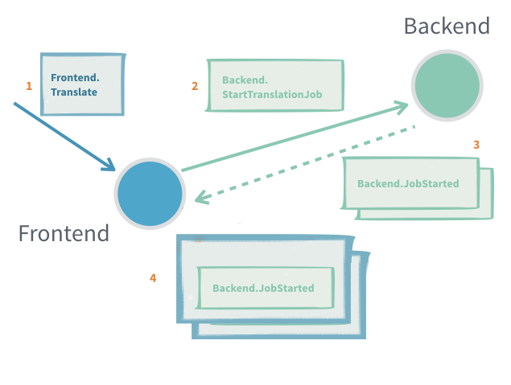

# Handling responses in Scala 3

Handling responses from other actors in Scala 3 is straightforward and in contrast with
Scala 2, it doesn't require the utilisation of message adapters and response wrappers.

A distinction exists between an actor's public protocol (`Command `) and its internal
protocol (`CommandAndResponse`). The latter is the union of the public protocol and all
the responses the actor should understand. This is union is implemented with Scala 3's
Union types.

**Example:**

Scala
:  @@snip [InteractionPatternsSpec.scala](/actor-typed-tests/src/test/scala-3/docs/org/apache/pekko/typed/InteractionPatterns3Spec.scala) { #adapted-response }

Let's have a look at the key changes with respect to the Pekko typed implementation in
Scala 2 (see the corresponding numbering in the example code).

* The type `CommandAndResponse` is the union of `Command` and `Backend.Response` (1)
* In the factory method (2) for the `Behavior` of the frontend actor, a
  `Behavior[CommandAndResponse]` is narrowed (5) to a `Behavior[Command]`. This works as
  the former is able to handle a superset of the messages that can be handled by the latter.
* The sending actor just sends its `self` @apidoc[actor.typed.ActorRef] in the `replyTo`
  field of the message (3)
* Responses are handled in a straightforward manner (4)

A more in-depth explanation of the concepts used in applying Scala 3's Union types can
be found in the following blog posts:

* [Using Dotty Union types with Akka Typed](https://blog.lunatech.com/posts/2020-02-12-using-dotty-union-types-with-akka-typed)
* [Using Dotty Union types with Akka Typed - Part II](https://blog.lunatech.com/posts/2020-02-19-using-dotty-union-types-with-akka-typed-part-II)

**Useful when:**

 * Subscribing to an actor that will send [many] response messages back

**Problems:**

 * It is hard to detect that a message request was not delivered or processed
 * Unless the protocol already includes a way to provide context, for example a request id
   that is also sent in the response, it is not possible to tie an interaction to some
   specific context without introducing a new, separate, actor